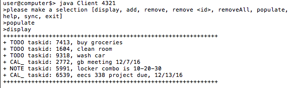

##Journal Client
####Asheq Ahmed ara47
######1. Project description:
Multi-threaded journal that maintains tasks such as to-do list items, calendar events and personal notes
Written in java to make use of classes and objects because that’s so much easier in java.

	* Task.java (implements a task object that contains taskid, status, content and type.  Status should indicate whether or not something has been done yet or not.  Type is a enum of todo, notes, calendar entry)
	* Journal.java (implements a queue of tasks using java ArrayList because it was quick and I don’t feel like writing an implementation of a real queue by extending Java.util.Queue)
	* TaskType.java (enum used in task.java)
	* TestJava.java (main method to testrun the journal for quick tests and stuff)
	* Server.java (takes in taskid’s from the socket and checks if it needs to update it’s version of the journal.  If it needs to update anything, it sends back the taskid’s of the tasks it needs to the socket for the client to respond with.  Then, it takes in task data to update tasks)
	* Client.java (has it’s own instance of a Journal that it updates with tasks when users enter them)

######2. Files included in .zip
######3. Data structures include:
	* Queue implementation of tasks using ArrayList
	* A Journal is a Queue of Tasks, implemented using ArrayList
	* A journal, however, is not an extension of Queue, because I honestly didn’t want to
	* Socket to share journal data, but this is a java posix socket

######4. Demo
Extract **ara47_final.zip**
open the directory in a linux shell

Use the `make` command to compile the project.

to begin, enter `java test` 

possible commands include: `display`, `add`, `remove`, `removeAll`, `populate` & `exit`.

enter `populate` to add example content to the Journal

enter `display`


